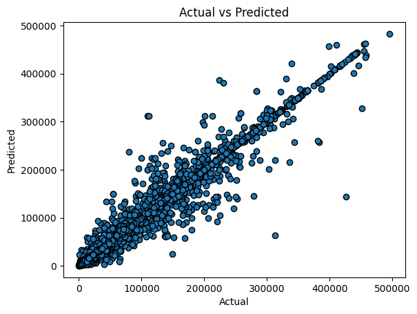

# Project Title

This project was developed as part of the **SAMSUNG INNOVATION CAMP**, focusing on Machine Learning Model and delivering it to the Farmers end. It utilizes technologies to assist farmers in making informed decisions regarding their farming practices.

# About Dataset

## Context
The science of training machines to learn and produce models for future predictions is widely used, and not for nothing. Agriculture plays a critical role in the global economy. With the continuing expansion of the human population understanding worldwide crop yield is central to addressing food security challenges and reducing the impacts of climate change.

Crop yield prediction is an important agricultural problem. The Agricultural yield primarily depends on weather conditions (rain, temperature, etc), pesticides and accurate information about history of crop yield is an important thing for making decisions related to agricultural risk management and future predictions.

# Acknowledgements
All dataset(publicly available dataset) here are taken form FAO (Food and Agriculture Organization) and World Data Bank.
 
[FAO](http://www.fao.org/home/en/) 
[WorldBank](https://data.worldbank.org/)

# Farming Planning App

## Overview

The Farming Planning App is designed to assist farmers in making informed decisions regarding their farming practices. Utilizing a machine learning model, the app predicts crop yield based on various factors such as climate conditions, geographic location, pesticide usage, and temperature. This tool aims to enhance agricultural productivity and sustainability.

## Features

- **Yield Prediction**: Predicts crop yield based on input parameters.
- **User-Friendly Interface**: Simple and intuitive UI for easy navigation.

## Technologies Used

- **Frontend**: Kotlin (Android App)
- **Backend**: Python (Flask framework)
- **Machine Learning**: Scikit-learn, Pandas, NumPy, Matplotlib, Seaborn
- **Database**: MySQL
- **Deployment**: Railway

## Installation

1. **Download the APK:**
   Visit the [Releases](https://github.com/Sauban-Git/CropYieldPrediction/releases) section of this repository and download the latest APK file.
   
2. **Install the APK:**
   - On your Android device, go to **Settings > Security** and enable **Unknown Sources** if it is not already enabled.
   - Locate the downloaded APK file in your device's file manager and tap on it to begin the installation process.
   - Follow the on-screen instructions to complete the installation.

3. **Launch the App:**
   Once installed, open the app from your device’s app drawer and start using!

## Usage

- **Start the App:** Launch the app and tap on start button.
- **Match Icons:** Fill the blanks parts with correct values for good predictions.
- **SErver Facility:** If server does not respond you can try other server too.

## Model performance

